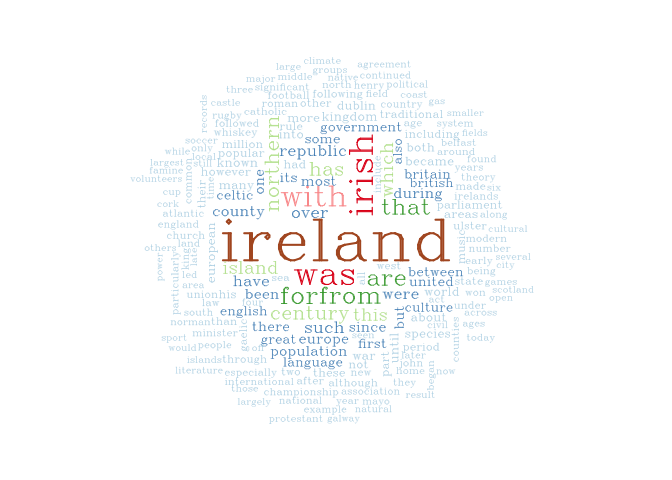

# Wikipedia Ireland Web Scrape
### Quick overview  
* Use `rvest` package to scrape the [Wikipedia page on Ireland](https://en.wikipedia.org/wiki/Ireland)  
+ Tame the larger of the two tables on the page and create some visualizations  
+ Munge the text of the entire page and create word frequency wordclouds to see
what words are mentioned most often on the page  
* This doc was compiled using knitr::spin, 
thanks to a [post by Dean Attali](http://deanattali.com/2015/03/24/knitrs-best-hidden-gem-spin/)  
  
  
  
  
  
***
#### Set things up


Load packages


```r
library(pacman)
p_load(knitr,  # for weaving this into pretty format
       XML,  # for web scraping 
       rvest,  # for web scraping
       quanteda,  # for term document matrices
       wordcloud,  # for making wordclouds
       tibble,  # for an easier way to work with data.frames
       dplyr,  # for data manipulation
       tm,  # for text mining
       readr,  # for parse_number()
       stringr,  # for string manipulation
       stringi,  # for string manipulation
       lubridate,  # for dates
       tidyr,  # for gather() and spread()
       DT,  # for kable()
       ggplot2,  # for plots
       ggvis  # for plots
)
```

Set page we want to scrape


```r
wiki_url <- "https://en.wikipedia.org/wiki/Ireland"
```

Parse the HTML and save as an object


```r
wiki_page <- read_html(wiki_url)
```

***
# Adventures in Table Taming  
There are two tables on the Ireland Wikipedia page. I'm interested in
the larger of the two.  
The idea is to use the extension [selectorgadget](http://selectorgadget.com/) to 
identify CSS selectors that wrap the bits of HTML we're interested in
so that we can select just the HTML associated with that selector.  
Scrape both tables using a more general selector that a wraps both of them.  
(In the browser, a "view page source" and command+F shows that the table 
we want is actually tagged with
`<table class="wikitable sortable">` and the smaller table is tagged with 
`<table class="wikitable">`, but using `html_nodes(".wikitable sortable")`
returns an empy list.)


```r
wiki_table <- 
  wiki_page %>%
  html_nodes(".wikitable") %>%
  html_table()
```

Check out what we've scraped


```r
wiki_table
```

```
## [[1]]
##                                            X1
## 1 Republic of Ireland: Border Midlands & West
## 2                                  €30 bn[92]
## 3                      €23,700 per person[93]
##                                        X2                               X3
## 1 Republic of Ireland: Southern & Eastern United Kingdom: Northern Ireland
## 2            €142 bn (Dublin €72.4bn)[92]  €43.4 bn (Belfast €20.9 bn)[93]
## 3                  €39,900 per person[93]           €21,000 per person[93]
## 
## [[2]]
##                                  Area Population Country       City
## 1                       Dublin Region      1.3 m     ROI     Dublin
## 2                   South-West Region    670,000     ROI       Cork
## 3                     Greater Belfast    720,000      NI    Belfast
## 4                         West Region    380,000     ROI     Galway
## 5                     Mid-West Region    340,000     ROI   Limerick
## 6                   South-East Region    460,000     ROI  Waterford
## 7                     Mid-East Region    475,000     ROI       Bray
## 8                       Border Region    430,000     ROI   Drogheda
## 9            East of Northern Ireland    430,000      NI Ballymeena
## 10                    Midlands Region    280,000     ROI    Athlone
## 11 West and South of Northern Ireland    400,000      NI      Newry
## 12          North of Northern Ireland    280,000      NI      Derry
## 13                              Total      6.4 m                   
##        GDP € GDP per person €
## 1   €72.4 bn          €57,200
## 2   €32.3 bn          €48,500
## 3   €20.9 bn          €33,550
## 4   €13.8 bn          €31,500
## 5   €11.4 bn          €30,300
## 6   €12.8 bn          €25,600
## 7   €13.3 bn          €24,700
## 8   €10.7 bn          €21,100
## 9    €9.5 bn          €20,300
## 10   €5.7 bn          €20,100
## 11   €8.4 bn          €19,300
## 12   €5.5 bn          €18,400
## 13 €216.7 bn
```

We've got two tables


```r
length(wiki_table) # a list of 2
```

```
## [1] 2
```

Select the table we want (the second one)


```r
emerald_table <- wiki_table[[2]]
```

#### Munge strings
Rename columns that contain `€` symbols


```r
em_tab <- emerald_table %>% 
  rename(
    GDP = `GDP €`,
    GDP_percap = `GDP per person €`
  )
```


Take out the last row of the table that just contains totals


```r
em_tab <- em_tab[1:(nrow(em_tab) - 1), ]
```

Check out table structure. All varaibles are characters.


```r
str(em_tab)
```

```
## 'data.frame':	12 obs. of  6 variables:
##  $ Area      : chr  "Dublin Region" "South-West Region" "Greater Belfast" "West Region" ...
##  $ Population: chr  "1.3 m" "670,000" "720,000" "380,000" ...
##  $ Country   : chr  "ROI" "ROI" "NI" "ROI" ...
##  $ City      : chr  "Dublin" "Cork" "Belfast" "Galway" ...
##  $ GDP       : chr  "€72.4 bn" "€32.3 bn" "€20.9 bn" "€13.8 bn" ...
##  $ GDP_percap: chr  "€57,200" "€48,500" "€33,550" "€31,500" ...
```

Make the table into a `tibble` so we can more easily see variable types
when we print the table


```r
em_tab <- as_tibble(em_tab)
```

We need to do some string substitutions:  
-- There's an "m" for million in the first row of the `Population`. We need
to make it into something that can be parsed as a number.  
(Since the column is still of type character and not numeric, we
can just replace it with scientific notation characters.)  
-- We want to do a similar thing for "bn" for billion in the GDP columns.  
-- We also want to take out the out `€` symbol  
So, we'll make a custom `gsub` function returns a tibble.


```r
multi_sub <- function(input, output, dat) {
  result <- dat
  for (i in 1 : length(input)) {
    result <- as_tibble(as.data.frame
                        (sapply(dat, gsub, 
                                pattern=input[i], replacement=output[i], 
                                   result)))
  }
  result
}
```

Make our replacements


```r
em_tab <- multi_sub(input = " m", output = "e+06", dat = em_tab)
em_tab <- multi_sub(input = "bn", output = "", dat = em_tab)
em_tab <- multi_sub(input = "€", output = "", dat = em_tab)
```

Our function makes all columns factors, so make the columns 
we need as numeric (eventually) into characters.


```r
em_tab$Population <- as.character(em_tab$Population)
em_tab$GDP <- as.character(em_tab$GDP)
em_tab$GDP_percap <- as.character(em_tab$GDP_percap)
```

Make that first element of `Population` into standard notation


```r
em_tab$Population[1] <- as.numeric(em_tab$Population[1]) # we first have to make it numeric
format(em_tab$Population[1], scientific = TRUE)
```

```
## [1] "1300000"
```

#### Set variable data types  
Numerize variables that should be numeric


```r
to.numerize <- c("Population", "GDP", "GDP_percap")
em_tab[, to.numerize] <- data.frame(apply
                                    (em_tab[, to.numerize], 2, 
                                    parse_number)) # use readr::parse_numer
```

Factorize variables that should be factors


```r
em_tab <- em_tab %>%
  rsalad::dfFactorize(
    ignore = c("Population", "GDP", "GDP_percap")  # in other words, select Area, City, and Country
  )
```

Multiply `GDP` by 1 bil (because we took out the trailing "b" earlier)


```r
em_tab <- em_tab
em_tab$GDP <- (em_tab$GDP)*(1e+09)
```

Check out our table


```r
kable(em_tab, format = "markdown")
```


|Area                               | Population|Country |City       |      GDP| GDP_percap|
|:----------------------------------|----------:|:-------|:----------|--------:|----------:|
|Dublin Region                      |    1300000|ROI     |Dublin     | 7.24e+10|      57200|
|South-West Region                  |     670000|ROI     |Cork       | 3.23e+10|      48500|
|Greater Belfast                    |     720000|NI      |Belfast    | 2.09e+10|      33550|
|West Region                        |     380000|ROI     |Galway     | 1.38e+10|      31500|
|Mid-West Region                    |     340000|ROI     |Limerick   | 1.14e+10|      30300|
|South-East Region                  |     460000|ROI     |Waterford  | 1.28e+10|      25600|
|Mid-East Region                    |     475000|ROI     |Bray       | 1.33e+10|      24700|
|Border Region                      |     430000|ROI     |Drogheda   | 1.07e+10|      21100|
|East of Northern Ireland           |     430000|NI      |Ballymeena | 9.50e+09|      20300|
|Midlands Region                    |     280000|ROI     |Athlone    | 5.70e+09|      20100|
|West and South of Northern Ireland |     400000|NI      |Newry      | 8.40e+09|      19300|
|North of Northern Ireland          |     280000|NI      |Derry      | 5.50e+09|      18400|

***
#### Visualize
Graph population and GDP per capita, coloring points by country


```r
gdp_by_country_plot <- ggplot(em_tab, aes(x=Population, y=GDP_percap, colour=Country)) + 
  geom_point() +
  ggtitle("Ireland and Northern Ireland: \n Population and GDP per capita") +
  ylab("GDP per capita") +
  theme_classic() +
  theme(axis.line.x = element_line(color="black", size = 0.3), # theme_classic() removes axes so draw them back in
        axis.line.y = element_line(color="black", size = 0.3)) 

print(gdp_by_country_plot)
```

<!-- -->

So it looks like the ROI is generally more populous and wealthier than Northern Ireland.  
What about `Area`s within the ROI?  


Filter down to just areas in the ROI (Republic of Ireland 
and also our region of interest, lol)
For Areas in the ROI, 
plot GDP vs. per capita GDP


```r
em_ROI <- em_tab %>%
  filter(Country == "ROI") %>% 
  droplevels()  # drop unused Areas (e.g., Greater Belfast) from legend
```

```r
ROI_plot <- ggplot(em_ROI, aes(x=GDP, y=GDP_percap, colour=Area)) + 
  geom_point() +
  ggtitle("Regions in Ireland: \n Population and GDP per capita") +
  ylab("GDP per capita") +
  theme_classic() +
  theme(axis.line.x = element_line(color="black", size = 0.3), 
        axis.line.y = element_line(color="black", size = 0.3)) 

print(ROI_plot)
```

<!-- -->

***
# Adventures in Text Munging and Wordclouding
***
Scrape all text (excluding citations) from the same Wikipedia page. Note that 
we're using the selector `p` in `html_nodes()`. If we use `#bodyContent` instead,
the citations at the bottom of the page get included, which we don't want.


```r
wiki_text <-
  wiki_page %>% 
  html_nodes("p") %>%  
  html_text
```

Check out our text


```r
head(wiki_text)
```


We have a list of paragraphs.


```r
length(wiki_text)  # 156 paragraphs
```

```
## [1] 156
```

For example, we can get the third paragraph of the page with


```r
wiki_text[[3]]
```

```
## [1] "Politically, Ireland is divided between the Republic of Ireland (officially named Ireland), which covers five-sixths of the island, and Northern Ireland, which is part of the United Kingdom, in the northeast of the island. In 2011 the population of Ireland was about 6.4 million, ranking it the second-most populous island in Europe after Great Britain. Just under 4.6 million live in the Republic of Ireland and just over 1.8 million live in Northern Ireland.[7]"
```

Combine our lists to one vector.  
Note that we can't just do `unlist(wiki_text)`.


```r
ireland <- NULL
for (i in 2:(length(wiki_text))) {   # omit first paragraph because it just says "in Europe  (green & dark grey)"
  ireland <- paste(ireland, as.character(wiki_text[i]), sep = ' ')
}
```


```r
length(ireland)  # good, our 156 paragraphs are now one vector
```

```
## [1] 1
```

Get all text to lowercase


```r
ireland <- tolower(ireland)
```

Take out all numbers


```r
ireland <- str_replace_all(ireland,"[0-9]+","")
```

Remove `\n` newlines


```r
ireland <- str_replace_all(ireland, "[\r\n]", "")  # same as # ireland <- gsub("\r?\n|\r", "", ireland)
```

***
#### Begin wordclouding
Much of the wordclouding inspiration was adapted 
from [this blog](https://quantmacro.wordpress.com/2016/04/30/web-scraping-for-text-mining-in-r/)  
Create a corpus


```r
i.corp <- Corpus(VectorSource(ireland))
```

Wrap strings into paragraphs so we can see what we have better  
Note that this is the `base::strwrap` not `stringr::str_wrap`


```r
strwrap(i.corp[[1]]) # [[1]] because this corpus contains one document
```

Take out punctuation and white space


```r
i.corp <- tm_map(i.corp, removePunctuation)
i.corp <- tm_map(i.corp, stripWhitespace)
```

Make corpus a plain text doc


```r
i.corp <- tm_map(i.corp, PlainTextDocument)
```

View what we've got


```r
strwrap(i.corp[[1]])
```

***
Make a document feature or document term matrix


```r
i.dfm <- tm::TermDocumentMatrix(i.corp)
```

Check out rows 1000 to 1010


```r
inspect(i.dfm[1000:1010, ] )
```

```
## <<TermDocumentMatrix (terms: 11, documents: 1)>>
## Non-/sparse entries: 11/0
## Sparsity           : 0%
## Maximal term length: 9
## Weighting          : term frequency (tf)
## 
##            Docs
## Terms       character(0)
##   explorer             1
##   export               1
##   exporter             1
##   exposed              1
##   expressed            1
##   extant               2
##   extend               1
##   extended             2
##   extending            2
##   extensive            1
##   extent               1
```

Convert dfm to matrix


```r
i.matrix <- as.matrix(i.dfm)
```

Label the frequency column


```r
colnames(i.matrix) <- 'frequency'
```

Sort terms by frequency


```r
i.sorted <- sort(rowSums(i.matrix), decreasing = TRUE)
```

Check out the ten most frequent words in the doc


```r
i.sorted[1:10]
```

```
##     the     and ireland   irish     was    with     for    from     are 
##    1088     459     252     125     118     104      79      77      73 
##    that 
##      68
```

Make our matrix into a data.frame, taking it from wide to long format


```r
i.dat <- data.frame(word = names(i.sorted), freq = i.sorted)
```

Check out the most frequent words


```r
head(i.dat)
```

```
##            word freq
## the         the 1088
## and         and  459
## ireland ireland  252
## irish     irish  125
## was         was  118
## with       with  104
```

Remove "the" and "and" because they're not interesting


```r
i.dat.trim <- i.dat %>% 
  filter(
    !(word %in% c("the", "and")))
```

Set RColorBrewer palate


```r
palette <- brewer.pal(12,"Paired")
```

Set background to black


```r
par(bg = 'black')
```

Generate the wordcloud!


```r
wordcloud(i.dat.trim$word, i.dat.trim$freq, random.order = FALSE,
          max.word = 200, color = palette,
          vfont = c("serif", "plain"))
```

<!-- -->


---
title: "scrape.R"
author: "amanda"
date: "Fri Sep  9 15:11:59 2016"
---
